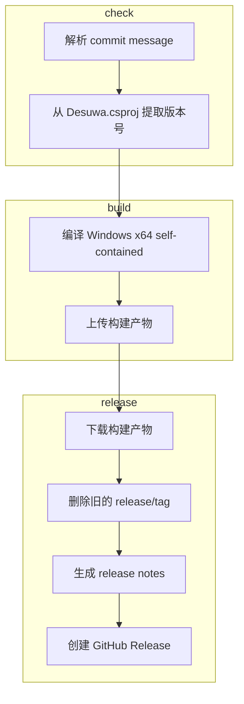

# Build & Release Workflow

## 📋 概述

CI/CD 流程完全由 **commit message 关键词** 驱动。推送到 `main` 或 `master` 分支时，GitHub Actions 会根据关键词自动执行相应操作。

## 🔑 关键词

| Commit message 中的关键词 | 构建 (Windows x64) | GitHub Release |
|---------------------------|:---:|:---:|
| `build action` | ✅ | ❌ |
| `build release` | ✅ | ✅ |

> **注意：** Pull Request 始终触发构建（不发布 Release）。关键词对 PR 无效。

## 🚀 使用示例

```bash
# ============================================================
# 仅构建，验证编译是否成功
# ============================================================
git commit --allow-empty -m "ci: test build (build action)"
git push

# ============================================================
# 构建 + 创建 GitHub Release
# ============================================================
git commit -m "release: v0.1.0 (build release)"
git push

# ============================================================
# 普通提交（不触发构建）
# ============================================================
git commit -m "docs: update README"
git push

git commit -m "fix: resolve UI rendering issue"
git push

git commit -m "feat: add new feature"
git push
```

## 🏗️ 构建目标

| 平台 | 架构 | 运行时 | 说明 |
|----------|:---:|--------|-------|
| Windows | x64 | Self-contained | 单文件 exe，无需安装 .NET 运行时 |

## 📦 流程阶段

```
check ──→ build ──→ release
  │         │         │
  │         │         └─ 下载构建产物
  │         │            删除旧的 release/tag
  │         │            生成 release notes
  │         │            创建 GitHub Release
  │         │
  │         └─ 编译 Windows x64 self-contained
  │            上传构建产物
  │
  └─ 解析 commit message
     从 Desuwa.csproj 提取版本号
```



## 📌 版本号

版本号从 `Desuwa.csproj` 中的 `<Version>` 标签自动提取，用于：
- Release tag 名称（例如 `v0.1.0`）
- 产物文件名（例如 `Desuwa-windows-x64-v0.1.0.exe`）
- exe 文件属性中的版本信息

### 如何更新版本号

编辑 `Desuwa.csproj` 文件：

```xml
<PropertyGroup>
    <!-- 修改这里的版本号 -->
    <Version>0.2.0</Version>
    <AssemblyVersion>0.2.0.0</AssemblyVersion>
    <FileVersion>0.2.0.0</FileVersion>
    ...
</PropertyGroup>
```

然后提交并触发构建：

```bash
git add Desuwa.csproj
git commit -m "release: v0.2.0 (build release)"
git push
```

## 🎯 Self-contained 发布

项目配置为 self-contained 发布模式：
- ✅ 单个 exe 文件，无需安装 .NET 运行时
- ✅ 可在没有 .NET 的 Windows 系统上直接运行
- ✅ 所有依赖项都打包在 exe 中

### 本地测试

```bash
cd D:\aaaStuffsaaa\from_git\github\Desuwa
dotnet publish -c Release -r win-x64 --self-contained true
# 输出在 bin\Release\net8.0-windows\win-x64\publish\Desuwa.exe
```
